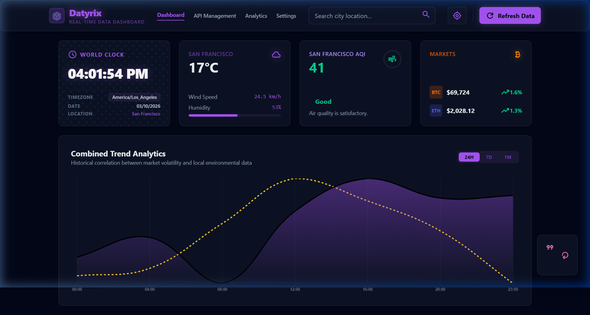
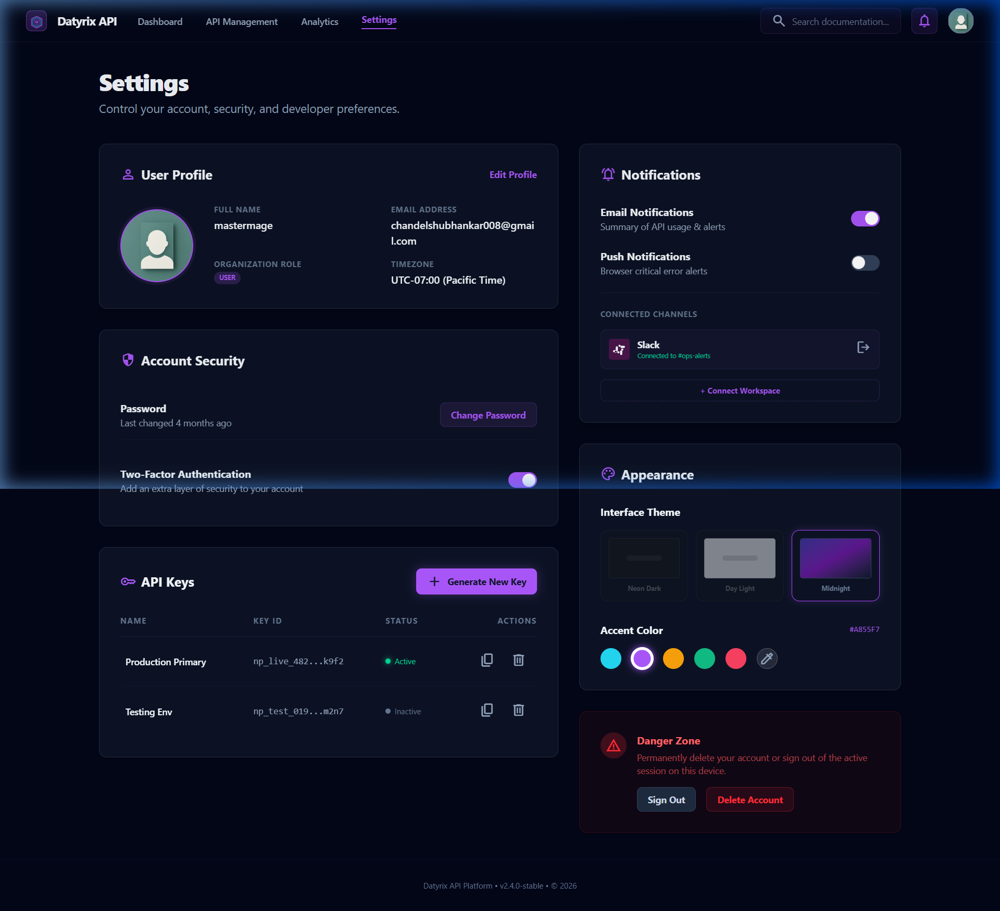
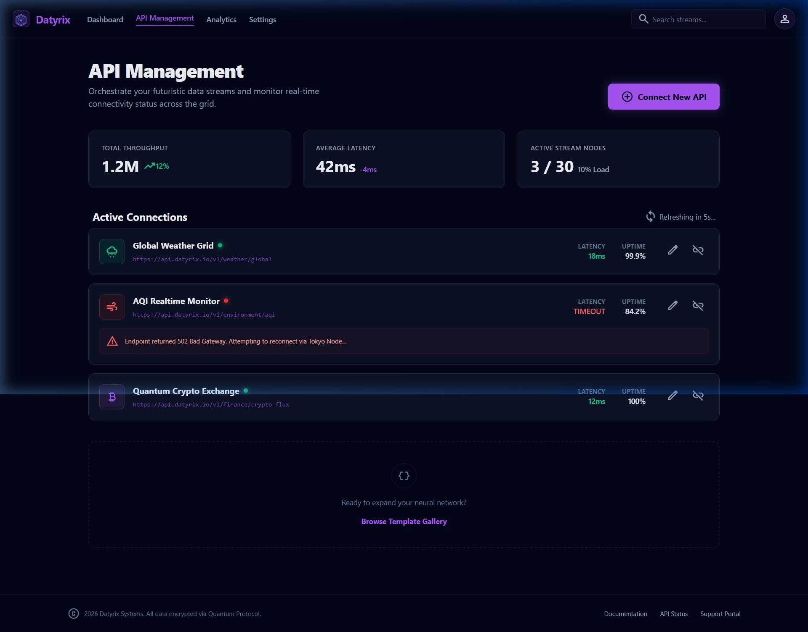

<h1 align="center">Datyrix</h1>

<p align="center">
  
  
  
  
</p>

> Datyrix is a high-performance, real-time API orchestration dashboard featuring a secure Supabase backend, responsive widgets, and a dynamic, user-customizable glassmorphic neon theme engine.

## Table of Contents
- [Features](#features)
- [Installation](#installation)
- [Usage Examples](#usage-examples)
- [Technologies Used](#technologies-used)
- [Contributing Guidelines](#contributing-guidelines)
- [License](#license)
- [Contact & Support](#contact--support)

## Features
- **Real-Time Data Integration:** Live feeds for Cryptocurrency prices, Global Weather data, Location-aware World Clock, and Air Quality Indexes.
- **Dynamic Theming Engine:** Personalize your interface with Midnight, Neon Dark, or Light modes, coupled with custom glowing accent colors that dynamically update across the entire UI.
- **Responsive Layout:** A fluid grid system that seamlessly adapts from ultra-wide desktop monitors down to a touch-friendly mobile interface with a native bottom tab navigation bar.
- **Secure Authentication:** Robust user management backed by Supabase, featuring protected routes and persistent user-specific theme preferences stored securely.
- **Resilient Architecture:** Bulletproof UI guarded by React Error Boundaries, ensuring individual widget API timeouts never crash the overarching application.

## UI Preview

### Main Dashboard


### Dynamic Theme Customization


### Mock API Management


## Installation

Follow these steps to set up the project locally on your machine.

### Prerequisites
- Node.js (v18 or higher recommended)
- npm or yarn
- A [Supabase](https://supabase.com/) account and project.

### Setup Instructions

1. **Clone the repository:**
   ```bash
   git clone https://github.com/Schandelxd/Datyrix.git
   cd Datyrix
   ```

2. **Install Dependencies:**
   ```bash
   npm install
   ```

3. **Environment Variables (Supabase):**
   This project uses Supabase for authentication. You must provide your own API keys for local development.
   - Go to your Supabase project settings and retrieve your `Project URL` and `anon public key`.
   - Create a `.env` file in the root directory.
   - Copy the following block and insert your keys:
     ```env
     VITE_SUPABASE_URL=your_supabase_project_url_here
     VITE_SUPABASE_ANON_KEY=your_supabase_anon_key_here
     ```
   *(Note: The `.env` file is safely ignored by git and will not be pushed to your public repository).*

4. **Run the Development Server:**
   ```bash
   npm run dev
   ```
   Open your browser to `http://localhost:5175/` to start exploring.

## Usage Examples
Datyrix functions primarily as a modular dashboard. 
- **Authentication:** Create an account to securely access the protected dashboard.
- **Customization:** Navigate to the `Settings` page to switch between UI themes and select a custom Neon Accent Color. Your selection will automatically save to your account and apply across all glows and charts.
- **Monitoring:** View real-time API aggregations immediately upon loading the main dashboard root.

## Technologies Used
- **Frontend Framework:** React 19 (Vite + HashRouter)
- **Styling:** Tailwind CSS v4
- **Animations:** Framer Motion
- **Data Visualization:** Chart.js & react-chartjs-2
- **Backend & Auth:** Supabase

## Contributing Guidelines
Contributions are what make the open-source community such an amazing place to learn, inspire, and create. Any contributions you make are **greatly appreciated**.

1. Fork the Project
2. Create your Feature Branch (`git checkout -b feature/AmazingFeature`)
3. Commit your Changes (`git commit -m 'Add some AmazingFeature'`)
4. Push to the Branch (`git push origin feature/AmazingFeature`)
5. Open a Pull Request

## License
Distributed under the MIT License. See `LICENSE` for more information.

## Contact & Support
Project Link: [https://github.com/Schandelxd/Datyrix](https://github.com/Schandelxd/Datyrix)  
If you encounter any bugs or have feature requests, please open an Issue on the GitHub repository.
